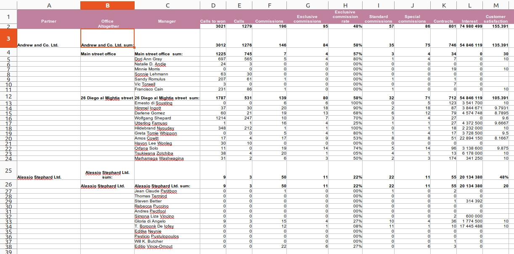
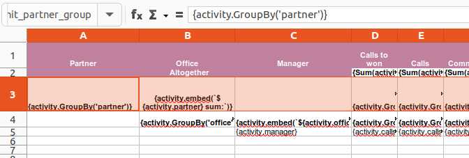

<p align="right">
  
</p>

# Reptor

## PhpSpreadsheet based report generator


The PHPSpreadsheet Report Generator is a PHP-orientated solution curated to empower users to generate reports seamlessly. Embedded with the prevailing attributes of the PHP 8.1 enabled PHPSpreadsheet library, this project ensures the generation of dynamic XLSX reports using Excel-based template files.

The project aims to revolutionize report generation in the _PHP world_ by converting raw data into comprehensive, digestible information punctuated with the expansive expressive ability of the Symfony Expression Language. Facilitating the inclusion of data sources or datasets makes it a versatile tool for diverse reporting needs.

Whether you are an individual aiming for personal data understanding or an enterprise seeking to streamline complex data analysis, the PHPSpreadsheet Report Generator serves to be an invaluable tool to garner insights, make strategic decisions or simply comprehend an array of information.

The project was highly inspired by [alhimik1986](https://github.com/alhimik1986) and his [PHP Excel Templator](https://github.com/alhimik1986/php-excel-templator) library.

## Key Features:

1. **Enhanced Report Generation**: Create reports efficiently in XLSX, PDF, HTML and other formats.
2. **Symfony Expression Language**: Harness the power of Symfony’s component to provide a simplified manipulation of your object graph.
3. **Data Sources or Datasets**: Include a multitude of data end points or vast datasets to generate reports that match your preferences and requirements.
4. **Template Language Extensibility**: The ability to extend the template language allows for more personalized and complex templates, accommodating a great degree of customization and functionality.
5. **Aggregator Functions**: The ability to use aggregator functions like as `sum`, `avg`, etc. the generation of reports with a greater degree of complexity and functionality.
6. **Group By**: The ability to group data by a specific column allows for the generation of reports that are more organized and structured.
7. **Flexible parameter declaration**: Parameters or properties / like data sources, datasets, etc. - can be specified in the spreadsheet template itself or can be declared in runtime. This allows for greater flexibility and customization.
8. **Native PHP functions or objects in cell formulas**: The ability to use native PHP functions or objects.
9. **Excel formulas in cell expressions**: The ability to use Excel formulas in cell expressions and they can be combined with the Symfony Expression Language based extensions or native PHP functions.
10. **User defined cell ranges as base units of processing**: Input data processing is controlled by interpreting the cell ranges as base units of processing.




## Installation

Reptor can be acquired and installed through a Git clone, followed by a Composer installation. Please follow these steps:

1. If you haven't installed Git or Composer, start by downloading and installing them. Use the official download pages for [Git](https://git-scm.com/downloads) and [Composer](https://getcomposer.org/download/).

2. Once Git and Composer are installed, clone Reptor repository into your local environment:

    ```bash
    git clone https://github.com/rixbeck/reptor.git
    ```
   
3. Navigate to the cloned repository and install the dependencies:

    ```bash
    cd reptor
    composer install
    ```

Make sure your PHP environment meets the requirements specified in the composer.json file, including enabled extensions like PDO, JSON, and SQLite3.
After completing these steps, Reptor is ready for use in your project.

## Use as a Composer Dependency

It is also possible to include Reptor in your PHP projects as a composer dependency rather than using it as a standalone project:

1. Navigate to your existing PHP project directory and open Terminal (or a command prompt)

    ```bash
    cd /path/to/your/php/project
    ```

2. Use the following composer command to add Reptor as a dependency in your project.

    ```bash
    composer require rixbeck/reptor
    ```

That's it! You have now successfully added Reptor as a dependency to your PHP project.

Concept Behind Reptor: Templating vs. Scripting in Report Generation
--------------------------------------------------------------------

When it comes to generating data-driven reports, there are fundamentally two approaches: scripting and templating.

### Scripting

Scripting involves writing custom code to handle data and format the report. It offers flexibility but requires extensive programming, making it complex and time-consuming for users without coding expertise.

### Templating

In contrast, templating, the approach chosen for Reptor, allows users to define report layouts and formatting directly within a familiar interface - an Excel file. This method is intuitive and user-friendly, significantly reducing the learning curve.

#### Why Templating with Excel?

1.  **Familiarity**: Excel is a widely-used tool with a familiar interface for many users, making it an ideal platform for designing report templates.
2.  **Flexibility**: Excel's native functionalities (like cells, formulas, and formatting options) offer significant flexibility in defining how data should be presented.
3.  **Efficiency**: By using Excel for templating, users can rapidly prototype and modify report designs without needing to delve into complex programming.
4.  **Dynamic Reports**: With Excel, we can create dynamic templates that automatically adjust and populate with data, offering a powerful way to generate customized reports.

Through Reptor, we bring the best of both worlds: the ease of templating through Excel and the power of PHP for processing and generating sophisticated reports.

### Advanced Cell and Row Styling with Excel Templates

One of the most significant advantages of using Excel templates in Reptor is the extensive styling capabilities it offers:

1.  **Cell Styling**: Users can leverage Excel's rich cell formatting options to define the appearance of individual cells. This includes font styles, colors, borders, and background fills, allowing for highly customized reports that are visually appealing and easy to read.

2.  **Row and Column Formatting**: Beyond single cells, Reptor allows for the styling of entire rows and columns. This feature is crucial for maintaining consistency and clarity in reports, especially when dealing with large datasets.

3.  **Conditional Formatting**: Excel's conditional formatting can be used to dynamically style cells based on the data they contain. This brings an added layer of interactivity to your reports, enabling users to quickly identify trends, anomalies, or key metrics at a glance.

4.  **Ease of Use**: By harnessing the familiar interface of Excel, users can style their reports without any additional learning curve, making it accessible to both technical and non-technical users.


Through Reptor, these styling capabilities are seamlessly integrated into the report generation process, ensuring that the final output is not only informative but also aesthetically pleasing and tailored to specific presentation needs.

### Utilizing Expression Language in Excel Cells

Reptor harnesses the power of Symfony Expression Language to enhance the dynamism of Excel templates:

1.  **Expression Language in Cells**: Users can embed expressions directly into Excel cells. These expressions, based on Symfony's robust framework, can manipulate and present data dynamically, adding significant functionality to your reports.

2.  **Variable and Object Integration**: A variety of user-defined or predefined objects and variables can be used within these expressions. These can be defined directly in the Excel document's custom properties or via an initializing boot script or in any pre-processing phase of the report generation.

3.  **Adaptors and Data Sources**: Reptor supports various data sources through its adaptable interface, including PDO, Socket, Array, and more, as seen in the `Reptor/Adaptor/Datasource` namespace. This flexibility allows for the integration of diverse data sets.

4.  **Uniform Connection Strings**: Data sources are connected using a uniform connection string, akin to Java or PHP DSN, simplifying the process of linking to and utilizing different datasets.


Through these features, Reptor allows for extensive customization and dynamic data processing, enabling users to create highly sophisticated and tailored reports directly from Excel.

Philosophy of Rendering: The Concept of Excel-Based Templating
--------------------------------------------------------------

Reptor introduces a unique approach to processing Excel templates, centered around the concept of 'Units':

1.  **Units - The Core of Templating**: In Reptor, 'Units' are the basic units of expressions that belong together, crucial for understanding how expressions within the same row of a dataset interact.

2.  **Defining Units with Named Ranges**: Users define these 'Units' using named ranges in Excel. This method organizes the template and prepares it for processing.

3.  **Sequential Processing and Evaluation**: The template processing involves sequentially evaluating these Units. During this phase, evaluated expressions transform into objects.

4.  **Priority and Types of Units**: Each object has a type, and these types have inherent priorities. The priority of an object determines the type of its corresponding Unit in the evaluation process.

5.  **Rendering Logic Driven by Unit Types**: Once Units are classified, the rendering logic takes over, driven by the type of each Unit. This step ensures that the final output aligns with the intended structure and format of the template.

### Understanding Units in Excel Templates

In the Reptor system, a 'Unit' encapsulates a collection of expressions that are logically related and processed together to produce a cohesive section of the report. 



Here's how it works:

*  **Binding Expressions**: As demonstrated in the provided figure, expressions are bound within named ranges in Excel, forming a 'Unit'. This ensures that data belonging to the same conceptual group is processed in unison.

* **Named Ranges**: The use of named ranges such as `unit_partner_group` helps identify and process these Units efficiently, keeping the related expressions tied together.

*   **Multiple Units Handling**: Users can define multiple Units within an Excel template, each representing a different section of the report or different data groupings.

*   **Sequential Processing**: Reptor iterates through these Units sequentially and processes their cells until reaches last one. After that emits event with the instruction of dataset iterators can fetch the next data row (if has). So the processing continues row by row this way, as long as there are remaining referred dataset rows in any units.

* **Expression Syntax**: The syntax `{{activity.GroupBy('partner')}}` within the cells is evaluated against the referred object provided to Reptor. This allows for dynamic content generation based on the data.


